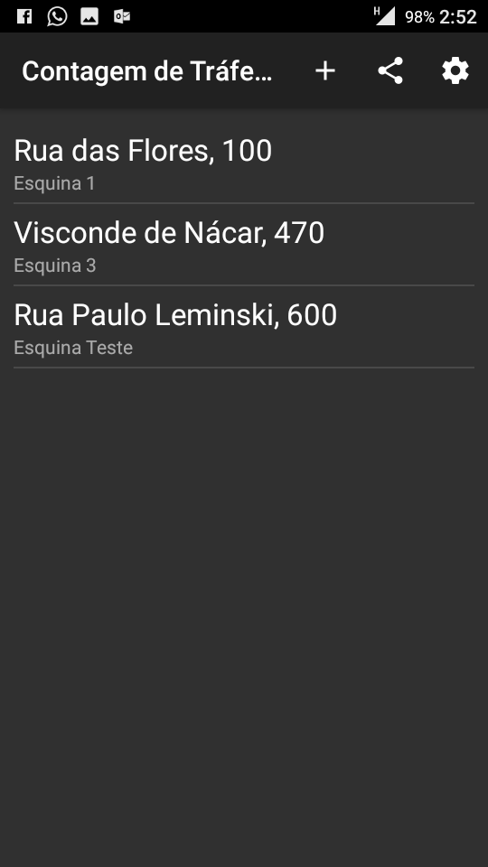
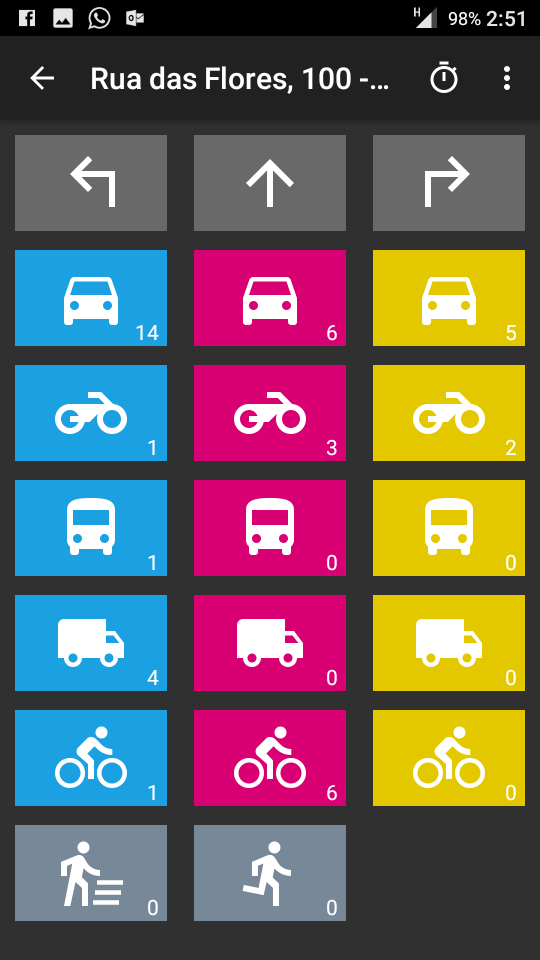
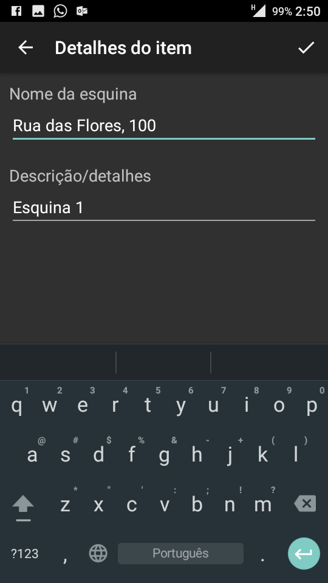
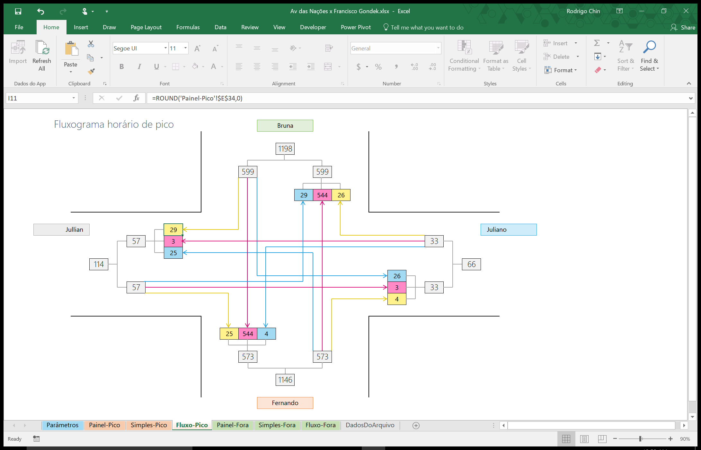
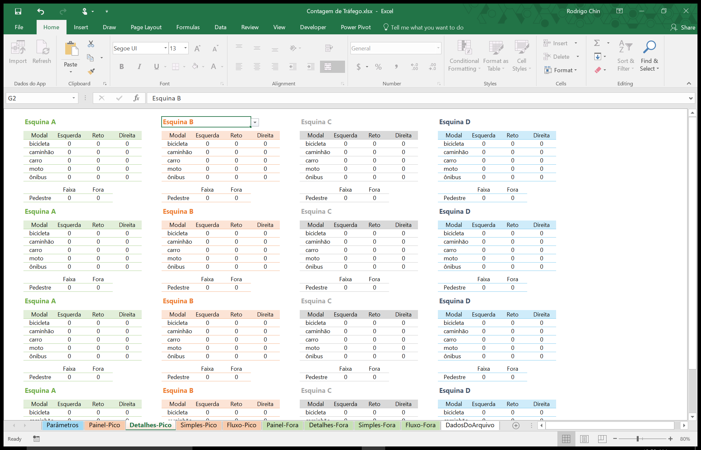

# Contagem de tráfego

App Android para facilitação de contagem de tráfego multimodal. Planilha integrada para análise dos dados coletados. É motivado pela dificuldade na realização de contagens volumétricas de veículos separados por modais e demorada compilação dos resultados posteriormente.

  Funcionalidades:
  <ul>
    <li>Cadastro de vários pontos de contagem;</li>
    <li>Página de contagem com vários modais separados por cor;</li>
    <li>Multiplataforma (Android);</li>
    <li>Temporizador para contagens de pico;</li>
    <li>Fluxograma resumido com resultados compilados.</li>
  </ul>

 

  
  
  

  

  

  <i>Desenvolvido por Rodrigo Chin. 2016</i>

